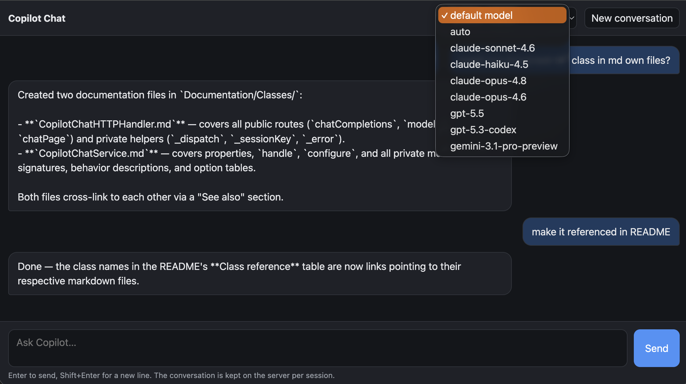

# CopilotSDKToOpenAI

A 4D project that wraps [GitHub Copilot](https://github.com/mesopelagique/CopilotSDK) behind an OpenAI-compatible HTTP API, so any OpenAI client can talk to Copilot without modification.



## Endpoints

| Method | Path | Description |
|--------|------|-------------|
| `GET`  | `/v1/models` | Lists available Copilot models in OpenAI format |
| `POST` | `/v1/chat/completions` | Chat completions (JSON and SSE streaming supported) |
| `GET`  | `/chat` | Bundled web chat page (`copilot-chat.html` in the web root) |

## Dependencies

- [mesopelagique/CopilotSDK](https://github.com/mesopelagique/CopilotSDK) — Copilot client SDK
- [4d/4D-AIKit](https://github.com/4d/4D-AIKit) — loaded automatically

## Session affinity

Each HTTP session maps to one persistent Copilot session (conversation state is kept server-side). The session key is resolved in order:

1. `X-Copilot-Session` request header
2. 4D web `Session.id`
3. Falls back to `"default"`

## Configuration

Send a `configure` task to the `CopilotChatService` singleton (inside the `CopilotChat` worker) with any of the following options:

| Option | Type | Description |
|--------|------|-------------|
| `cliPath` | Text | Path to the Copilot CLI binary |
| `workingDirectory` | Text | Working directory for the CLI |
| `gitHubToken` | Text | GitHub token (overrides logged-in user) |
| `useLoggedInUser` | Boolean | Use the currently logged-in GitHub account |
| `model` | Text | Default model to use |
| `approveAll` | Boolean | Auto-approve tool permission requests (default: `false`) |
| `permissions` | Object | Allow/deny/ask tool policy — see [Tool permissions](#tool-permissions) |
| `permissionsFile` | Text | Path to a JSON file holding the same `permissions` policy |
| `tools` | Collection | Server-side tool declarations and handlers |

## Tool permissions

Instead of the blanket `approveAll`, you can whitelist (and blacklist) exactly which
tools and commands a Copilot session may run, the way Claude's `settings.json` or the
Copilot CLI allow-lists work. The policy is handled by the
[`ToolPermissions`](Documentation/Classes/ToolPermissions.md) class and can be passed
inline or loaded from a file:

```4d
$service.configure({\
	permissions: {\
		defaultDecision: "reject"; \
		approveReadOnly: True; \
		allow: ["Read"; "Shell(git status)"; "Shell(npm run test:*)"]; \
		deny: ["Shell(rm:*)"; "Shell(curl:*)"; "Read(**/.env)"]; \
		ask: ["Shell(git push:*)"]}})

// …or load it from disk (same shape, see Resources/tool-permissions.example.json)
$service.configure({permissionsFile: "/path/to/tool-permissions.json"})
```

Each rule is a `Target(pattern)` string. The target selects a Copilot permission kind
(`Shell`/`Bash`, `Read`, `Write`, `Url`, `Mcp`, `Tool`, `Memory`, `*`, or a literal MCP/tool
name); `pattern` is a glob (`*`, `?`, and Claude's `:*` suffix) matched against the command,
path or URL. Resolution order: **deny** (always wins) → `approveAll` → **allow** →
read-only auto-approve → **ask** → `defaultDecision`.

## Class reference

| Class | Description |
|-------|-------------|
| [`CopilotChatHTTPHandler`](Documentation/Classes/CopilotChatHTTPHandler.md) | HTTP request handlers — routes incoming requests and returns responses |
| [`CopilotChatService`](Documentation/Classes/CopilotChatService.md) | Worker singleton — manages Copilot client and per-session state |
| [`ToolPermissions`](Documentation/Classes/ToolPermissions.md) | Allow/deny/ask tool policy — decides which tool & shell requests a session may run |
